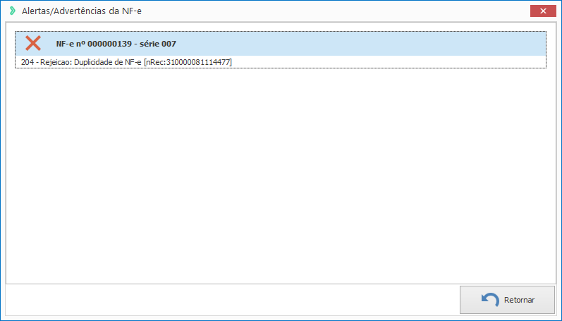

### ** Ocorrência ** ###
Ao realizar o envio da NF-e é retornada a mensagem ** "Duplicidade de NF-e [nRec:999999999999999]" **.

### ** Causa ** ###
A faixa utilizada já existe na base de dados da SEFAZ.

### ** Solução ** ###
Acesse o [Portal da Nota Fiscal Eletrônica](https://www.nfe.fazenda.gov.br/portal/consultaRecaptcha.aspx?tipoConsulta=resumo&tipoConteudo=7PhJ+gAVw2g=) e realize a consulta através da chave de acesso:

* Caso a consulta retorne a NF-a como autorizada ou cancelada pelo emitente entre em contato com a nossa equipe de [suporte](https://exatasoftware.com/suporte/).
* Caso a consulta retorne NF-e inexistente realize a consulta da NF-e através do Exata e reenvie.