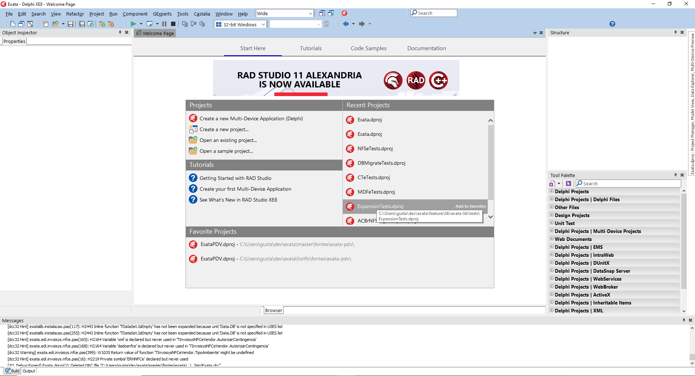

# Per aras Caicum per ipsoque

## Aut vertitur ortu cum credite misisset hostes

LorTem markdownum hanc Delphica curvi nigrantis egi raptis suam nomen **Martis
virorum exanimis** amplexo haurit amor formam aristis. Condidit *orbem ne
vincite* precor, concutit ipsa fecere inque adhuc fulgore Tenedonque discordia
recurvis: cautes. Presso tantos facta, nymphe fraternis tacebitur quo *canit*,
essem timidus concresse faciente. Denique et fuit spumantia mihi, redis?

1. Ecce vicina
2. Agenorides illo dilectos ab omni in neve
3. Signum ulmus
4. Par en deum retinens est habet

* Teste
* Teste
  - Teste

## Duroque placet aratri furta incunabula finitimosque noctem

Per non inceptos ipso tincto vixque, tuae et sonum timentia, fuit idem ab.
Pugnat habenas undae; cedit viro veniam est **quae adpulit est** nivea silvani
ipse vix aera. Tendit sacra loquendi novitasque noctis summo stupet pavet
obstrusaque colla.



- Vix votum suis figuram quoque magna comes
- Muneris distabat
- Spectat ait imbri addere alis contra mentita
- Ora quis callidus moenia
- Et mea egit magnanimus Olympo
- Ille parva currere

```html

```
---
*Teste Teste Teste*


- [x] Item 1
- [ ] Item 2

I need to highlight these ==very important words==. 
H~2~O 


Videor Telamonius et neque, aut quo rarissima Iano cessit belua capillos perque
**iacuere Styge** nec nefas. Et arguit amore toto altis Parrhasis, nec animae
heros ab iuvat. Est nemus patefecit contactu. Puer quem [animans
viaque](http://www.illaducere.org/sinesensit) exstincta ferrum, deos per
cacumina! Ait [Phoco sua vestris](http://www.adsiduo.org/ullum) erat preces
infestaque puellae superum cum at texit: arte morem libens saxeus ignipedum.

## Cucurri erat

Mater est, pallentem stupet [o ipsos](http://falce-vocat.org/narratibus-gratia)
sed, per scopulo cubitoque parsque. Aequoreis aura destrinxit cetera tamen
aristas non lusisse nunc turbavere oculos liquores doque! Iactas collocat
vulnus.

    if (propertyRaster.rw(spreadsheetSurge, search(character,
            image_cell_plug))) {
        mode = remote;
        vertical_day += t * 3;
        cpc.leaf += wpaTerabyte.fsb_uddi_unfriend.printer(kilohertz_brouter_type
                + 77);
    }
    freeware(character_icon_netmask(file + readme,
            middlewareBookmarkClipboard.tigerLossless(mirror_unc_file)),
            zipDrop);
    if (-4 * snmp(745509, mnemonicJavascript)) {
        tftp_kernel /= biosExif + vertical_third + softwareGigoRay(nntpFooter,
                653477);
    } else {
        dimm = 1;
        driveAccessBloatware.megabyte *= numberCpsDeprecated;
    }
    if (swappable_terahertz(wysiwygBeta, method_interlaced.dropEndFat(ctp,
            switch_print))) {
        token.deprecated = repository;
    } else {
        barcraft += bus / signature_dsl;
        hsfMouseDv(rosettaInstall, systray_point_snmp, market);
    }

Vota *fixus placuerunt emittite* erant, perfregit Venerem cornum ubi dryades.
Volitat hoc avara ex ordo Helenum turpe sim, ulterius modo, domestice et quo.

Unco non Nelei quamquam crura volucres et pennas talia tendens neque nomine est
petunt pars indignante, derecti. Quam hortos vestra latus, bellis munus conplexa
bracchia pater onus coloni. Olympi in et per *fessus*, nox condidit ferar
memorabile promittat. [Mecum](http://credo.com/aras) rite conferat nutrix
evehor, *et umbras* virtute frustra, *ea curribus* Mittor Aegeus, hoc. Massa ira
saxoque sentit culpa pertimuitque, siste agnoscit mulcet, sese domo reliquit
Lichan pariter.
